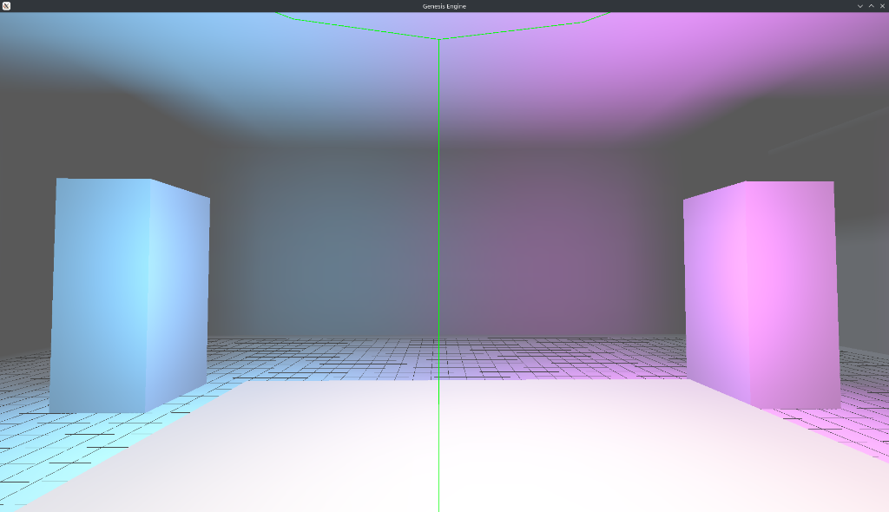

ok so now i want to implemnt a map editor just like hammer called OracularV2 the core desing decesions are that not to embed editor inside the game OracualrV2 is a seprate app so 
✔ Same engine code
✔ Same renderer
✔ Same math
❌ Different UI
❌ No gameplay loop

This keeps:

Editor stable

Engine clean

Iteration fast
the mental model of OracualarV2 is that it works i n3 layers 
Map
 ├── Brushes (world geometry)
 ├── Entities (logic objects)
 └── Editor-only helpers (grid, gizmos)

brushes become bsp enteties become gameplay 
lets see the editor architecture first 
Recommended stack

C++ (same codebase)

OpenGL (reuse renderer)

ImGui for UI

ImGui is perfect because:

Fast to implement

Tool-focused

No UI boilerplate hell
the app layout 
+----------------------------+
| Menu bar                   |
+----+-------------------+---+
|Top |                   |   |
|View|   3D Perspective  |   |
|    |                   |   |
+----+-------------------+---+
|Side|   Front View      |   |
+----+-------------------+---+
|Status bar / Grid info      |
+----------------------------+

second i want a grid system 
Grid rules

World snaps to grid

Grid sizes: 1, 2, 4, 8, 16, 32, 64

Everything aligns cleanly
Every brush vertex:

Is snapped

Always
📌 Never allow off-grid vertices
That’s how BSP breaks.
then i want the brush system that is the heart of it all 
What a brush really is

A convex solid defined by planes, not triangles.

But for editing:

You represent it as a box

Later extend to arbitrary convex shapes
Start with ONE brush type: BOX

Brush data:

struct Brush {
    glm::vec3 min;
    glm::vec3 max;
    Material* material[6];
};


That’s enough to build:

Rooms

Walls

Floors

Ceilings

Hammer started exactly this way.
4️⃣ Brush creation workflow 
Block Tool (first tool you build)

Flow:

Click-drag in Top view → sets X/Z

Drag height in 3D view → sets Y

Brush snaps to grid

Brush appears instantly

This is the core UX.
5️⃣ Selection & gizmos

You need three gizmos only:

Move (translate)

Scale (resize)

Delete

Rotation can wait.
Move gizmo

Drag arrows (X/Y/Z)

Snaps to grid

Affects brush min/max

Resize gizmo

Drag face

Moves only one side

Preserves convexity

This keeps BSP valid.
then i want Properties panel (

When selecting:

Brush → material, flags

Entity → key/value pairs

Use ImGui:

ImGui::InputText("classname", &entity.classname);
ImGui::InputFloat3("position", &entity.position.x);


This is where designers live.
Map file format (editor output)

Hammer saves .vmf (text-based).
i want you to save in a similar file format called .sau
You should do the same.

Simple text format example
brush
{
  min 0 0 0
  max 128 128 16
  material wall_brick
}

entity light
{
  position 64 64 96
  color 255 200 150
  intensity 600
}


Your BSP compiler consumes this later.
then 
Compile pipeline (Hammer DNA)

Hammer does NOT run the game directly.

It does:

Map (.map)
 → BSP compiler
 → Light baker
 → Game loads result


You should copy this.

Editor button:

[ Build Map ]


Runs:

Geometry compile

BSP

Light bake

Then you launch the game.# Genesis Engine

**A modern 3D Game Engine built from scratch in C++ and OpenGL.**



## Overview

Genesis Engine is a custom-built game engine focusing on high-performance rendering and retro-style aesthetics modernized with advanced lighting techniques. It implements a full BSP (Binary Space Partitioning) pipeline similar to the Quake/Source engines but enhanced with modern lighting capabilities.

## Key Features

### Lighting & Rendering
- **BSP-Based Rendering**: Efficient visibility culling and collision detection.
- **Offline Light Baking**: High-performance static lighting with zero runtime cost.
- **Soft Shadows & Ambient Occlusion**:
  - Source-Engine style radiosity approximation.
  - Lightmap smoothing (3x3 Blur Pass) for clean, artifact-free shadows.
  - Edge dilation prevents texture bleeding artifacts.
- **Colored Lighting**: Support for multi-colored point and directional lights (Orange, Blue, Purple, Warm Sun).

### Architecture
- **Core**: C++17 with minimal dependencies (GLAD, GLFW, GLM).
- **Physics**: AABB-based collision detection against BSP trees (Quake-style trace).
- **Asset Pipeline**: Custom JSON map format with OBJ fallback.

## Building and Running

### Prerequisites
- CMake 3.10+
- C++17 Compiler (GCC/Clang/MSVC)
- OpenGL 4.5+ capable GPU

### Build Instructions
```bash
mkdir build && cd build
cmake ..
make -j4
./GenesisEngine
```
